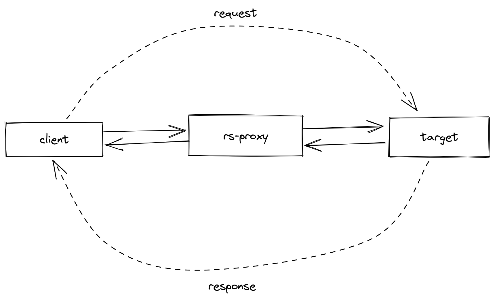
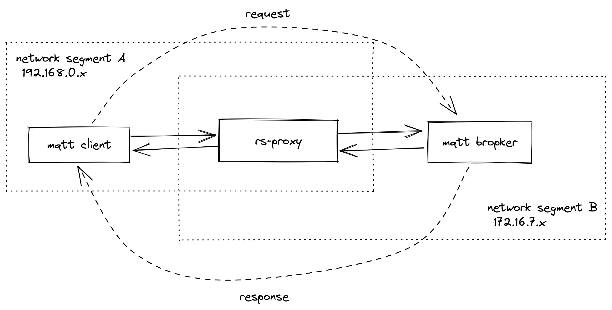

# rs-proxy
A simple tcp proxy service.



## Usage

```shell
./rs-proxy --listen 21883 --target 192.168.199.152:1883
```

```shell
./rs-proxy -h
rs-proxy 0.1.0
a simple tcp proxy service

USAGE:
    rs-proxy [OPTIONS] --target <TARGET>

OPTIONS:
    -h, --help               Print help information
    -l, --listen <LISTEN>    local listen port, default 21883, example: 31883
    -t, --target <TARGET>    target server address, example: 192.168.0.10:1883
    -V, --version            Print version information
```

## Examples
Communication across network segments.

